# A Survey on Facial Expression Recognition of Static and Dynamic Emotions

This is the official repository for our [paper](https://arxiv.org/pdf/2408.15777) entitled *“A Survey on Facial Expression Recognition of Static and Dynamic Emotions”*.

## Taxonomy Overview

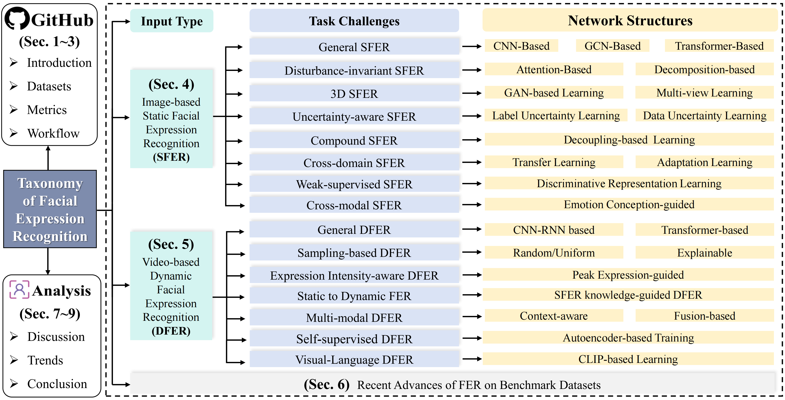

Taxonomy of FER of static and dynamic emotions. We present a hierarchical taxonomy that categorizes existing FER models by input type, task challenges, and network structures within a systematic framework, aiming to provide a comprehensive overview of the current FER research landscape. First, we have introduced datasets, metrics, and workflow (including literature and codes) into a public GitHub repository. Then, image-based SFER and video- based DFER overcome different task challenges using various learning strategies and model designs. Following, we analyzed recent advances of FER on benchmark datasets. Finally, we discussed and concluded some important issues and potential trends in FER, highlighting directions for future developments.

## Comparisons with SOTA FER-related reviews

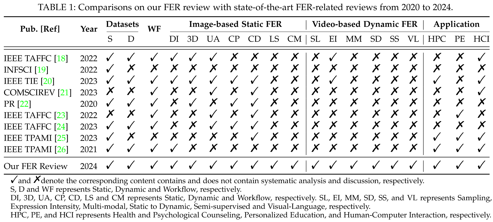

## Datasets

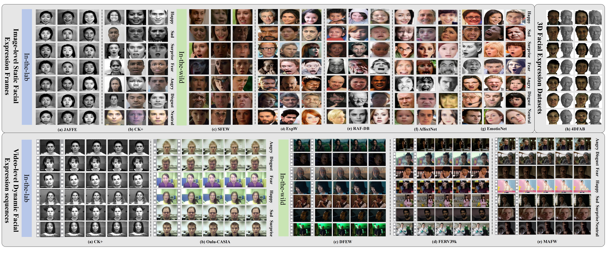

Image-based static facial frames (Above) and video-based dynamic facial sequences (Below) of seven basic emotions in the lab and wild. Samples are from (a) JAFFE, (b) CK+, (c) SFEW, (d) ExpW, (e) RAF-DB, (f) AffectNet, (g) EmotioNet, (h) CK+, (i) Oulu-CASIA, (j) DFEW, (k) FERV39k, and (l) MAFW.

## Workflow of Generic Facial Expression Recognition

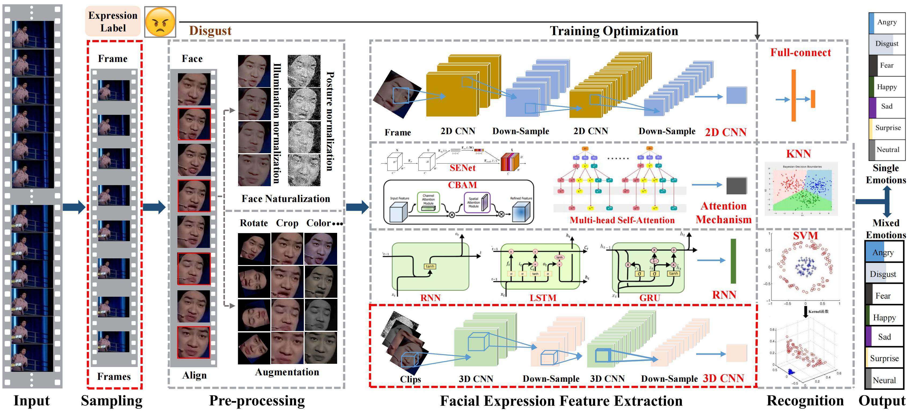

The workflow and main components of generic facial expression recognition.

## Image-based Static FER

Image-based static facial expression recognition (SFER) involves extracting features from a single image, which captures complex spatial information that related to facial expressions, such as landmarks, and their geometric structures and relationships. In the following, we will first introduce the general architecture of SFER, and then elaborate specific design of SFER methods from the challenge-solving perspectives, including disturbance-invariant SFER, 3D SFER, uncertainty-aware SFER, compound SFER, cross-domain SFER, limited-supervised SFER, and cross-modal SFER.

### General SFER

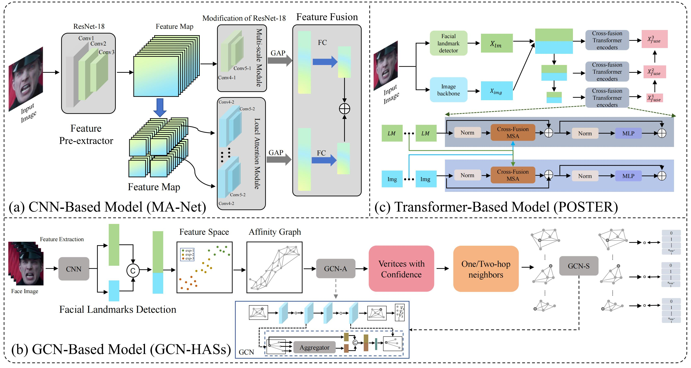

The architecture of general SFER. Figure is reproduced based on (a) CNN-based model, (b) GCN-based model, and (c) Transformer-based model.

### Disturbance-invariant SFER

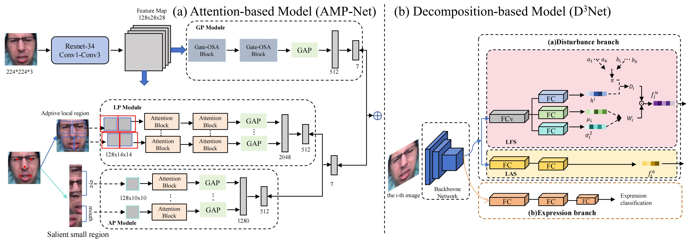

The architecture of disturbance-invariant SFER. Figure is reproduced based on (a) Attention-based model (AMP-Net) and (b) Decomposition-based model.

### 3D SFER

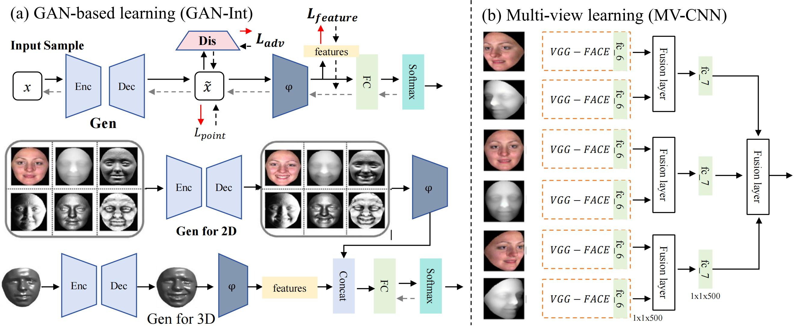

The architecture of 3D SFER. Figure is reproduced based on (a) GAN-based learning (GAN-Int) and (b) Multi-view learning (MV-CNN).

### Uncertainty-aware SFER

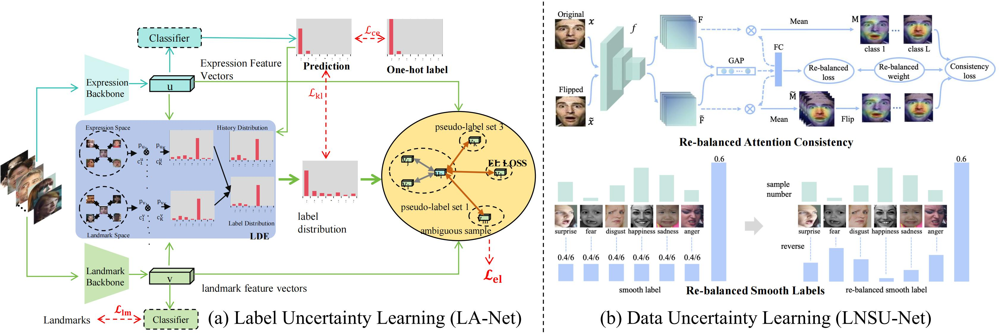

The architecture of uncertainty-aware SFER. Figure is reproduced based on (a) the label uncertainty learning (LA-Net) and (b) data uncertainty learning (LNSU-Net).

### Compound SFER

Compound emotions refer to complex emotional states formed by the combination of at least two basic emotions, which are not independent, discrete categories but exist within a continuous emotional spectrum composed of multiple dimensions. Compared with discrete "basic" emotions or a few dimensions, compound emotions provide a more accurate representation of the diversity and continuity of human complex emotions.

### Cross-domain SFER

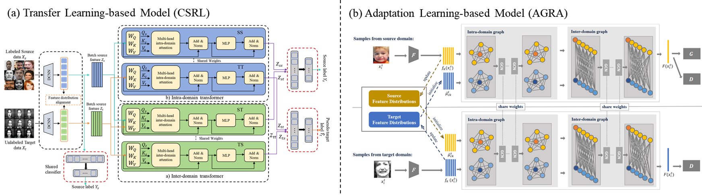

The architecture of cross-domain SFER. Figure is reproduced based on (a) the transfer learning-based model (CSRL) and (b) the adaption learning-based model (AGRA).

### Weak-supervised SFER

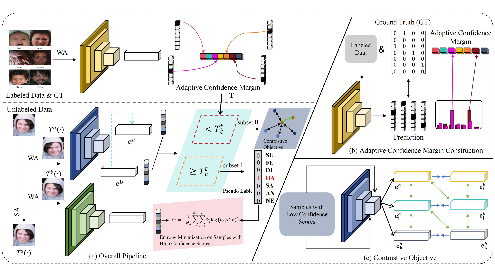

The architecture of weak-supervised SFER. Figure is reproduced based on the Ada-CM.

### Cross-modal SFER

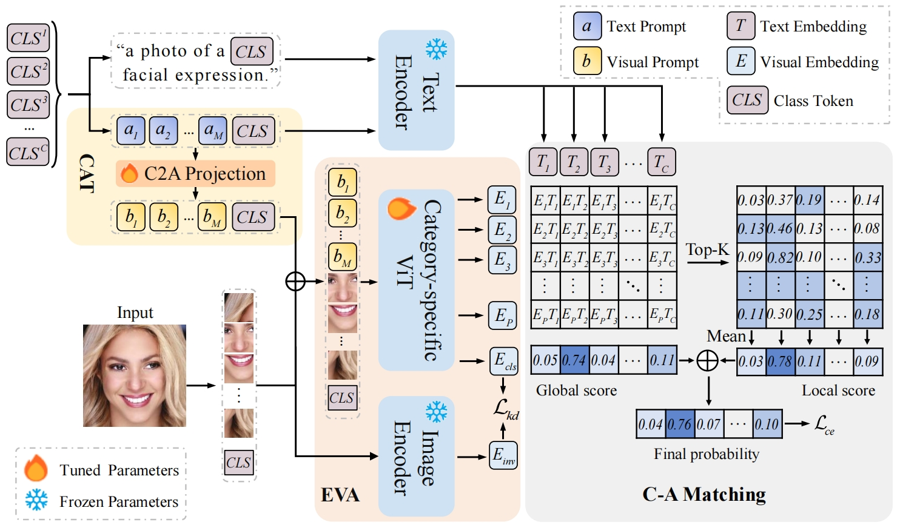

The architecture of cross-modal SFER. Figure is reproduced based on the CEprompt.

## Citation

If you find our work useful, please cite our paper:

```latex
@article{,
  author    = {Yan Wang, Shaoqi Yan, Yang Liu, Wei Song, Jing Liu, Yang Chang, Xinji Mai, Xiping Hu, Wenqiang Zhang, Zhongxue Gan},
  title     = {A Survey on Facial Expression Recognition of Static and Dynamic Emotions},
  journal   = {},
  year      = {2024},
}
```
